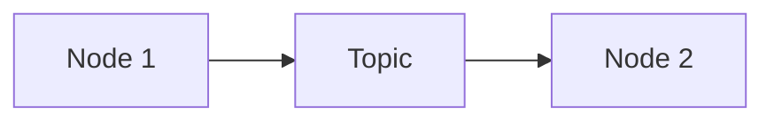

# Quickstart: Physical AI & Humanoid Robotics Book

**Feature**: 001-physical-ai-robotics-book
**Date**: 2025-12-10

## Overview

This guide helps authors set up their environment for contributing to the Physical AI & Humanoid Robotics Book.

## Prerequisites

### System Requirements

| Component | Minimum | Recommended |
|-----------|---------|-------------|
| OS | Ubuntu 22.04 / WSL2 | Ubuntu 22.04 native |
| RAM | 16 GB | 32 GB |
| Storage | 50 GB free | 100 GB SSD |
| GPU | None (Weeks 1-6 only) | RTX 3060+ (full course) |
| Node.js | 18.x | 20.x LTS |

### Required Tools

```bash
# Node.js and npm (for Docusaurus)
node --version  # Should be 18.x or higher
npm --version   # Should be 10.x or higher

# Git
git --version

# Python (for validation scripts)
python3 --version  # Should be 3.10+
```

## Quick Setup

### 1. Clone Repository

```bash
git clone https://github.com/your-org/physical-ai-humanoid-robotics.git
cd physical-ai-humanoid-robotics
```

### 2. Install Dependencies

```bash
# Install Docusaurus dependencies
npm install

# Install Python validation tools
pip install textstat  # For readability scoring
```

### 3. Start Development Server

```bash
npm run start
```

The site will be available at `http://localhost:3000`.

### 4. Build for Production

```bash
npm run build
```

Build output will be in the `build/` directory.

## Project Structure

```
physical-ai-humanoid-robotics/
├── docs/                    # Book content (Markdown/MDX)
│   ├── intro.md
│   ├── week-01/
│   ├── week-02/
│   ...
│   └── week-13/
├── src/
│   ├── components/          # Custom MDX components
│   ├── css/
│   └── pages/
├── static/
│   ├── diagrams/           # Diagram source files
│   ├── code/               # Companion code examples
│   └── img/
├── specs/                   # Feature specifications
├── docusaurus.config.js
├── sidebars.js
└── package.json
```

## Authoring Workflow

### Creating a New Chapter

1. Create a new `.md` or `.mdx` file in the appropriate `docs/week-XX/` directory
2. Add frontmatter:

```markdown
---
sidebar_position: 1
title: Chapter Title
description: Brief description for SEO
---

# Chapter Title

Content here...
```

3. Update `sidebars.js` if needed

### Adding Code Examples

Use fenced code blocks with language tags:

````markdown
```python title="publisher_node.py"
import rclpy
from rclpy.node import Node

class MinimalPublisher(Node):
    def __init__(self):
        super().__init__('minimal_publisher')
        # highlight-next-line
        self.publisher_ = self.create_publisher(String, 'topic', 10)
```
````

### Adding Diagrams

1. Create source file in `static/diagrams/`
2. For Mermaid diagrams, use inline:

````markdown

````

3. For draw.io diagrams, export to PNG/SVG and reference:

```markdown

```

### Citations (APA Format)

Use inline citations:

```markdown
ROS 2 uses a distributed discovery mechanism (Open Robotics, 2024).
```

Add to chapter bibliography:

```markdown
## References

Open Robotics. (2024). *ROS 2 Humble Hawksbill documentation*.
    https://docs.ros.org/en/humble/
```

## Validation

### Check Readability

```bash
python scripts/check_readability.py docs/week-01/intro.md
# Target: Flesch-Kincaid grade 9-11
```

### Validate Links

```bash
npm run build
# Build will fail if broken links exist
```

### Test Code Examples

All code examples should be tested in the reference environment before inclusion. See `research.md` for environment specifications.

## Custom Components

### Terminal Output

```jsx
<Terminal>
$ ros2 topic list
/parameter_events
/rosout
</Terminal>
```

### Hardware Requirements

```jsx
<HardwareReq tier="recommended">
RTX 3060 or higher GPU required for this section.
</HardwareReq>
```

### Exercise Block

```jsx
<Exercise title="Create Your First Node" difficulty="beginner" time="15 min">
1. Create a new Python file...
2. Import rclpy...
</Exercise>
```

## Common Tasks

### Add a New Module

1. Create directory: `docs/week-XX/`
2. Add `index.md` with module overview
3. Add chapter files
4. Add exercises in `docs/week-XX/exercises/`
5. Update `sidebars.js`

### Update Dependencies

```bash
npm update
npm audit fix
```

### Deploy to GitHub Pages

```bash
npm run deploy
```

## Resources

- [Docusaurus Documentation](https://docusaurus.io/docs)
- [ROS 2 Humble Documentation](https://docs.ros.org/en/humble/)
- [Gazebo Harmonic Documentation](https://gazebosim.org/docs/harmonic/)
- [Isaac Sim Documentation](https://docs.omniverse.nvidia.com/isaacsim/)

## Getting Help

- Check existing specifications in `specs/001-physical-ai-robotics-book/`
- Review the constitution at `.specify/memory/constitution.md`
- Open an issue for technical questions
